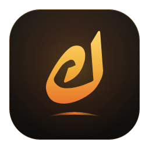

<div align="center">



# ريكو · Rico

**مساعد ذكاء اصطناعي يحكي ليبي ويخدم على جهازك بدون إنترنت.**
An offline AI assistant that speaks Libyan Arabic and runs entirely on your own computer.

[⬇️ Download / تنزيل](https://github.com/giumaa/rico-ai/releases/latest)

</div>

## Features · المميزات
- 🗣️ Fluent Libyan dialect by default; English and Modern Standard Arabic on request.
- 🖼️ Understands images you attach (vision models).
- 🔒 100% offline after the one-time model download — no account, no login, no telemetry, no analytics.
- 💻 Runs on Windows, macOS and Linux. Pick a model by your RAM: 8 GB → Rico Lite, 16 GB → Rico, 32 GB+ → Rico Max.
- 🌗 Dark and light themes, Ruqaa-style Arabic typography.

Rico is developed and trained by **Juma Abouras (جمعة أبوراس)**.

## Download · التنزيل
Get the installer for your system from the [latest release](https://github.com/giumaa/rico-ai/releases/latest):

| System | File |
|---|---|
| Windows 10/11 (x64) | `Rico-Setup-<version>-x64.exe` |
| macOS Apple Silicon | `Rico-<version>-mac-arm64.dmg` |
| macOS Intel | `Rico-<version>-mac-x64.dmg` |
| Linux | `.AppImage` or `.deb` |

SHA-256 checksums are published with every release (`SHA256SUMS.txt`).

## Privacy policy · سياسة الخصوصية
This program will not transfer any information to other networked systems unless specifically requested by the user or the person installing or operating it.

The only network connection Rico ever makes is downloading a model file when you explicitly press "Download" (from this repository's GitHub Releases, or Hugging Face as a fallback). Chats, images and settings are stored only on your device and never leave it. There is no telemetry, no crash reporting, no auto-update check and no account.

البرنامج ما يبعث أي معلومة لأي جهة. الاتصال الوحيد هو تحميل ملف النموذج لما تضغط «تحميل» بنفسك، ومحادثاتك وصورك تبقى على جهازك بس.

## Code signing policy
Free code signing provided by [SignPath.io](https://about.signpath.io/), certificate by [SignPath Foundation](https://signpath.org/).

- **Committers and reviewers:** [Juma Abouras (@giumaa)](https://github.com/giumaa)
- **Approvers:** [Juma Abouras (@giumaa)](https://github.com/giumaa)

All release binaries are built from this public repository by GitHub Actions (`.github/workflows/build-app.yml`); every signing request is approved manually. See [docs/signing.md](docs/signing.md).

## Building from source
```bash
cd app
npm ci
npm run build
npm run dist:win   # or dist:mac / dist:linux
```
Model pipeline (distillation, fine-tuning, GGUF packaging): see [docs/ml.md](docs/ml.md).

## License
Source code: [MIT](LICENSE). Model weights are licensed by their original authors (Apache-2.0 for Qwen and Gemma models); see `app/resources/LICENSES/`.
